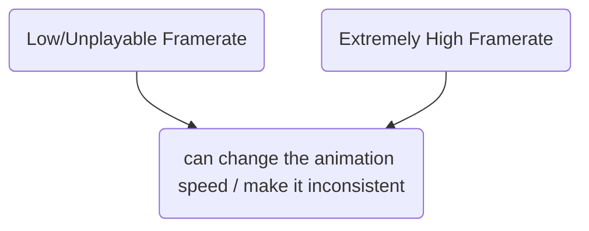
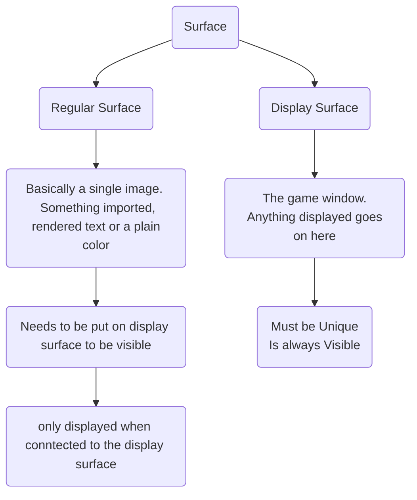
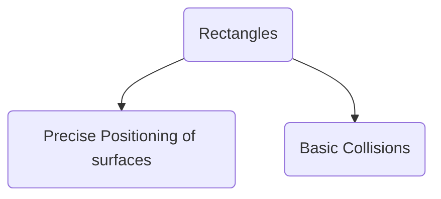
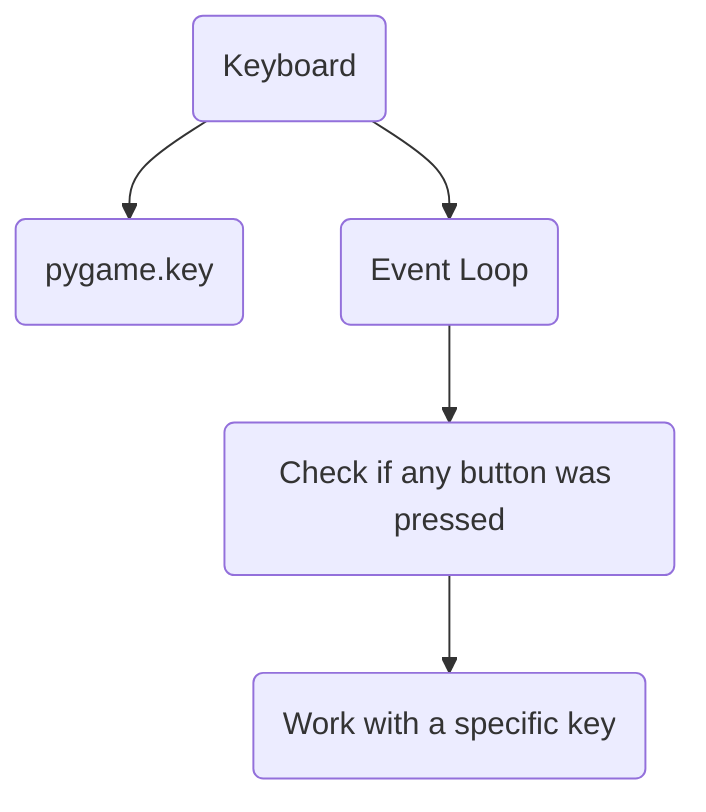
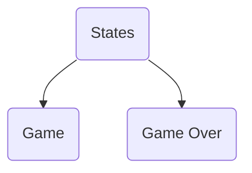

# First Python Game using Pygame

[Tut Video](https://www.youtube.com/watch?v=AY9MnQ4x3zk&t=19s)

**The Event Loop:** Checking Player input
## What Pygame does

- It helps you draw images. (and play sounds)
- Check for player inputs.
	* `input()` function just stops your code and is thus useless for games.
- Good with collision detection
## Installing Pygame
`pip install pygame`

## Creating a blank window
```python
import  pygame

pygame.init()
width, height = 800, 600
screen = pygame.display.set_mode((width, height))
```
> The window is created but closes as our code ends after python executes the screen code and Hence, our program stops. We need to use a a `while True` loop to keep it going 

### Controlling the Framerate

*FPS can change the animation speed and make it inconsistent*


Using Clock
```python
clock = pygame.time.Clock() # This will give a clock object
# In While loop
clock.tick(60) # Caps fps at 60
```

## Displaying Images 



```python
# Surfaces
# Creating surfaces
S1Width, S1Hight = 200, 300
Test_Surface = pygame.Surface((S1Width, S1Hight)) # Same as creating the screen
# Images
Sky_Surface = pygame.image.load('Resources\Images\Sky.png')
Ground_Surface = pygame.image.load('Resources\Images\ground.png')
# Text
Text_Surface = test_font.render('Dungeon Run', False, 'Black') # .render(text, Anti-Alias(Smooth edges), color)

# Displaying the Surfaces

# To attach the regular surafce with the display surface
# Needs two arguments (The surface, the position)
# screen.blit(Test_Surface, (200, 100)) # BlIT: Block Image Transfer | You put one surface on top of another surface.
# Here sky is rendered below the ground
screen.blit(Sky_Surface, (0, 0))
screen.blit(Ground_Surface, (0, 300))
screen.blit(Text_Surface, (300, 50))
```

[**Color Codes**](https://htmlcolorcodes.com/color-names/)

> To Create text on screen follow steps:
	> - Create a font (text size and style)
	> - Write Text on the Surface
	> - Blit the text surface

**Syntaxes**

```python
screen.blit(Surface, (Width, Height))
test_font.render(Text, Anti-Alias, Color)
```
## Basic Animations

*To Animate an object in our game, we just need to make it's position change over time and not be fixed constant values but variable*

For e.g. Lets animate a snail,
```python
# Snail

Snail_Surface = pygame.image.load('Resources\Images\Snail\snail1.png').convert_alpha() # 72x36
Snail_x = 600
SnailDirection = True
SnailSpeed = 0.5

# In while loop

# To and Fro Motion
# The snail will reach one end then change direction then
# will continue till the other end and repeat the same process
Snail_x += -SnailSpeed if SnailDirection else SnailSpeed
if Snail_x == 0 or Snail_x >= 760:
SnailDirection = not SnailDirection

# Continous Motion
# After the snail disappears into the left side it will
# come back on the right side.
Snail_x -= SnailSpeed
if Snail_x < -72: Snail_x = 872

screen.blit(Snail_Surface, (Snail_x, 264))
```

>**NOTE: Converting our surfaces -** Our snail is in png file, but ideally we want them to be converted to something that pygame can work with easily, so when we are importing an image we add the following line at the end of it:
>`.convert()` If you done wan't alpha values (i.e. tranparency) else use `.convert_alpha()`  to keep the transparency.

## Rectangles



### Precise Positioning of surfaces


```python
# Snail

Snail_Surface = pygame.image.load('Resources\Images\Snail\snail1.png').convert_alpha() # 72x36
Snail_x = 600
SnailDirection = True
SnailSpeed = 3
Snail_rectangle = Snail_Surface.get_rect(midbottom = (600, 300))

# Player

Player_Surface = pygame.image.load('Resources\Images\Player\player_walk_1.png').convert_alpha()

# We can pygame.Rect(left, top, Player_rect_width, Player_rect_height) but we need a rectangle
# that is identical to the surface

Player_rectangle = Player_Surface.get_rect(midbottom = (80, 300))

# In while loop
screen.blit(Snail_Surface, Snail_rectangle)
screen.blit(Player_Surface, Player_rectangle)

# To and Fro Motion
# Snail_rectangle.left += -SnailSpeed if SnailDirection else SnailSpeed
# if Snail_rectangle.left == 0 or Snail_rectangle.left >= 760:
# SnailDirection = not SnailDirection  

# Continous Motion
Snail_rectangle.left -= SnailSpeed
if  Snail_rectangle.left < -72: Snail_rectangle.left = 872
```

## Collisions with Rectangles

- To check whether a rectangle is colliding with another rectangle, we use `rect1.colliderect(rect2)`. eg
	- `Player_rectangle.colliderect(Snail_rectangle)`
- To Check whether a point `(x,y)` lies within a rectangle we use, `rect1.collidepoint((x,y))`. Useful to detect mouse clicks on for eg buttons.
*To Get Mouse Position, we have two ways,*

| `pygame.mouse`  | `Event loop` |
|:--------:|:-------------:|
| Mouse Pos, clicks buttons, visibility etc.| Get Mouse Motion, clicks, position etc. |

#### **`pygame.mouse`**
```python
mouse_pos = pygame.mouse.get_pos()
if  Player_rectangle.collidepoint(mouse_pos) and pygame.mouse.get_pressed()[0]:
print("Click")
``` 
> **NOTE:** `pygame.mouse.get_pressed()` returns a tuple of boolean values `(True/False (RMB), True/False (MMB), True/False (LMB))`  which show that which mouse button is being pressed respectively.

#### **Event Loop**
```python
if  event.type == pygame.MOUSEMOTION:
	print(event.pos)
```
## Drawing with rectangels

```python
# UI
Score_Surface = score_font.render(f'Score: {score}', True, 'Black')
Score_rectangle = Score_Surface.get_rect(midbottom = (width // 2, 50))
```

Using `pygame.draw` we can draw rectangles, circles, lines, points, ellipses etc.

Adding a background color to our score
```python
pygame.draw.rect(screen, '#947EC3', Score_rectangle, 10) # surface, color, rect
pygame.draw.rect(screen, (182, 137, 192), Score_rectangle) # surface, color, rect
screen.blit(Score_Surface, Score_rectangle)
```
Drawing a line that follows your mouse
```python
pygame.draw.line(screen, 'Red', (0,0), pygame.mouse.get_pos())
```
## The Player Character

### Keyboard Input


[List of keys](https://www.pygame.org/docs/ref/key.html#pygame.key.get_pressed)

**Using `pygame.key`:**
```python
# This will return all the buttons and their current state
keys = pygame.key.get_pressed()
if keys[pygame.K_a]:
	print("a")
```
**Using Event Loops:**
```python
for  event  in  pygame.event.get():
	if  event.type == pygame.QUIT:
		pygame.quit()
		exit()
	if event.type == pygame.KEYDOWN:
		if event.key == pygame.K_a
		print("Keydown")
	if event.type == pygame.KEYUP:
		print("Keyup")
```

> **Why are there two methods to get input ?**
>  When using classes you want the controls inside of the relevent class. `pygame.mouse` and `pygame.keys` are great for that.
>  For more general stuff, like closing the game, the event loop is  the ideal place.

### Jumping, Gravity And Creating a floor

Gravity is **Exponential** *means the longer you fall the faster you fall*.
Basic idea:
```python
gravity += some value
player.y += gravity
```
For Floor, we just check the y-level of the gorund and prevent the player from ffalling thorugh it.

```python
# Player
Player_Surface = pygame.image.load('Resources\Images\Player\player_walk_1.png').convert_alpha()
Player_rectangle = Player_Surface.get_rect(midbottom = (80, 300))
Player_Gravity = 0

# Loop

while  True:
	for  event  in  pygame.event.get():
		if  event.type == pygame.QUIT:
			pygame.quit()
			exit()
		if  event.type == pygame.KEYDOWN:
			if  event.key == pygame.K_SPACE  and  Player_rectangle.bottom == 300: 
				Player_Gravity = -20
		if  event.type == pygame.MOUSEBUTTONDOWN:
			if  Player_rectangle.collidepoint(event.pos) and  Player_rectangle.bottom == 300: 
				Player_Gravity = -20

# Player
Player_Gravity += 1
Player_rectangle.y += Player_Gravity
if  Player_rectangle.bottom >= 300: Player_rectangle.bottom = 300
screen.blit(Player_Surface, Player_rectangle)
```
> We don't recreate the actual physics, we make them look like they are real but they aren't

## Creating Different Game States


So all we have to do is that all that we are drawing in the game we have to put it in an `if` statement with a condition `game_active` and once the game ends the if changes to a menu screen.

## Transforming Surfaces


