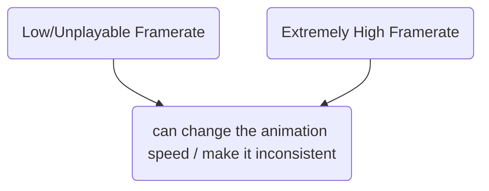
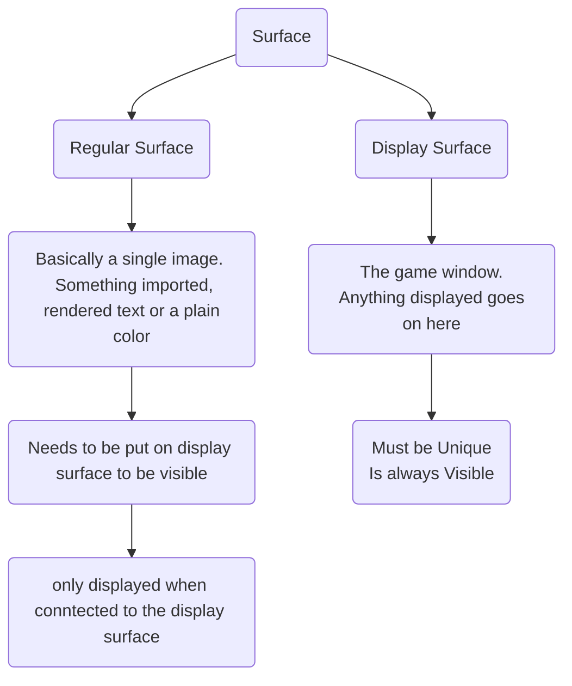
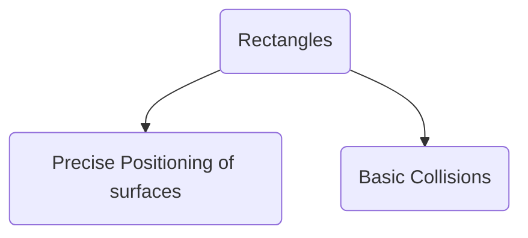
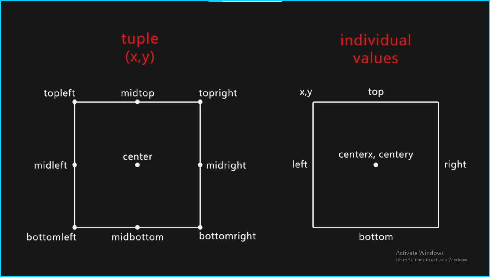

# First Python Game using Pygame

[Tut Video](https://www.youtube.com/watch?v=AY9MnQ4x3zk&t=19s)

**The Event Loop:** Checking Player input
## What Pygame does

- It helps you draw images. (and play sounds)
- Check for player inputs.
	* `input()` function just stops your code and is thus useless for games.
- Good with collision detection
## Installing Pygame
`pip install pygame`

## Creating a blank window
```python
import  pygame

pygame.init()
width, height = 800, 600
screen = pygame.display.set_mode((width, height))
```
> The window is created but closes as our code ends after python executes the screen code and Hence, our program stops. We need to use a a `while True` loop to keep it going 

### Controlling the Framerate

*FPS can change the animation speed and make it inconsistent*


Using Clock
```python
clock = pygame.time.Clock() # This will give a clock object
# In While loop
clock.tick(60) # Caps fps at 60
```

## Displaying Images 



```python
# Surfaces
# Creating surfaces
S1Width, S1Hight = 200, 300
Test_Surface = pygame.Surface((S1Width, S1Hight)) # Same as creating the screen
# Images
Sky_Surface = pygame.image.load('Resources\Images\Sky.png')
Ground_Surface = pygame.image.load('Resources\Images\ground.png')
# Text
Text_Surface = test_font.render('Dungeon Run', False, 'Black') # .render(text, Anti-Alias(Smooth edges), color)

# Displaying the Surfaces

# To attach the regular surafce with the display surface
# Needs two arguments (The surface, the position)
# screen.blit(Test_Surface, (200, 100)) # BlIT: Block Image Transfer | You put one surface on top of another surface.
# Here sky is rendered below the ground
screen.blit(Sky_Surface, (0, 0))
screen.blit(Ground_Surface, (0, 300))
screen.blit(Text_Surface, (300, 50))
```

[**Color Codes**](https://htmlcolorcodes.com/color-names/)

> To Create text on screen follow steps:
	> - Create a font (text size and style)
	> - Write Text on the Surface
	> - Blit the text surface

**Syntaxes**

```python
screen.blit(Surface, (Width, Height))
test_font.render(Text, Anti-Alias, Color)
```
## Basic Animations

*To Animate an object in our game, we just need to make it's position change over time and not be fixed constant values but variable*

For e.g. Lets animate a snail,
```python
# Snail

Snail_Surface = pygame.image.load('Resources\Images\Snail\snail1.png').convert_alpha() # 72x36
Snail_x = 600
SnailDirection = True
SnailSpeed = 0.5

# In while loop

# To and Fro Motion
# The snail will reach one end then change direction then
# will continue till the other end and repeat the same process
Snail_x += -SnailSpeed if SnailDirection else SnailSpeed
if Snail_x == 0 or Snail_x >= 760:
SnailDirection = not SnailDirection

# Continous Motion
# After the snail disappears into the left side it will
# come back on the right side.
Snail_x -= SnailSpeed
if Snail_x < -72: Snail_x = 872

screen.blit(Snail_Surface, (Snail_x, 264))
```

>**NOTE: Converting our surfaces -** Our snail is in png file, but ideally we want them to be converted to something that pygame can work with easily, so when we are importing an image we add the following line at the end of it:
>`.convert()` If you done wan't alpha values (i.e. tranparency) else use `.convert_alpha()`  to keep the transparency.

## Rectangles



### Precise Positioning of surfaces


